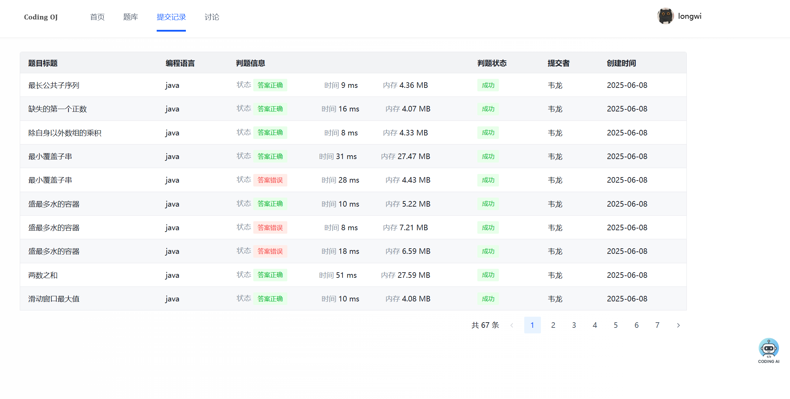
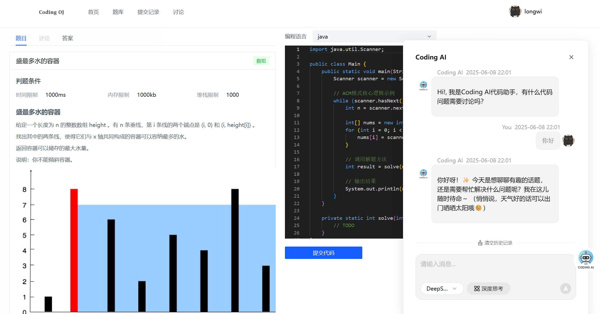
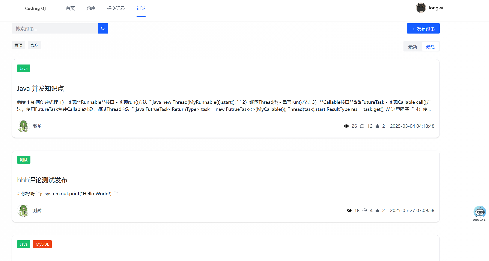
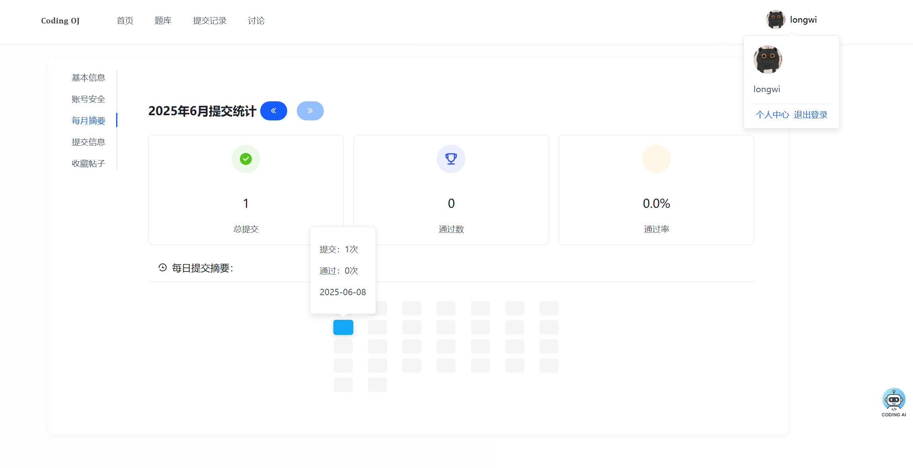

# LONG OJ 在线刷题平台

项目体验地址 => [𝐂𝐨𝐝𝐢𝐧𝐠 𝐎𝐉](http://oj.longcoding.top/#/)

功能列表：

- [x] 代码沙箱，支持Java原生和Docker容器运行代码，用例使用文件形式，暂时为ACM答题形式
- [x] 用户中心，用户信息CRUD，每月刷题总结
- [x] 讨论功能CRUD
- [x] 加入大模型AI编程助手 [deepseek] 流式问答和深度思考

代办事项：

- [ ] 目前使用线程池进行异步判题，优化为使用MQ队列进行判题，本地消息表实现可靠性
- [ ] 题目根据标签搜索

### 部分页面展示

