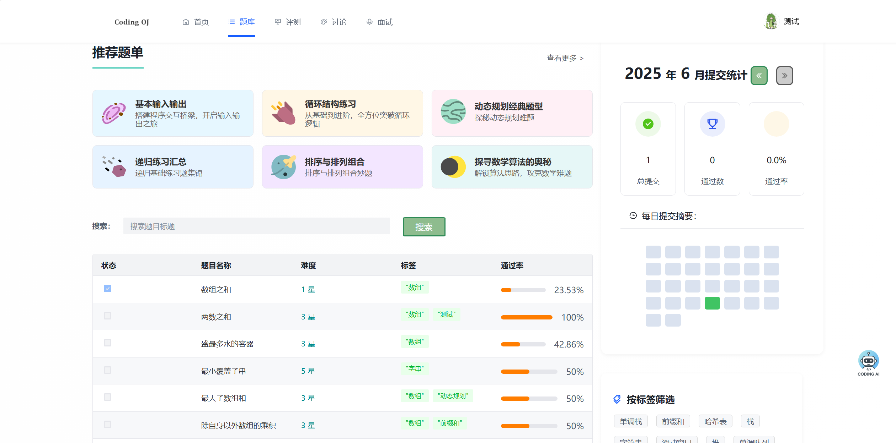
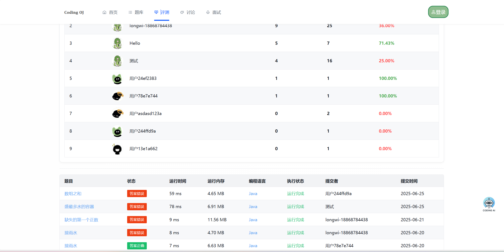
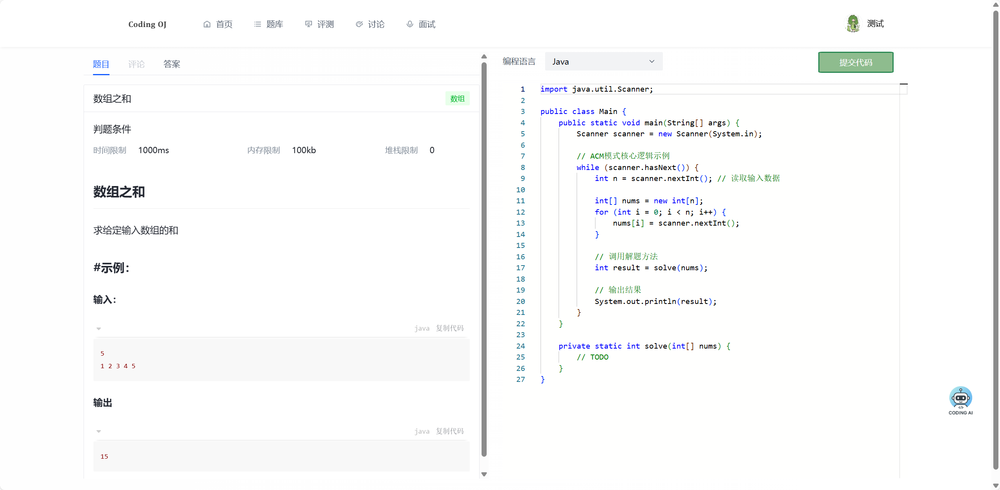
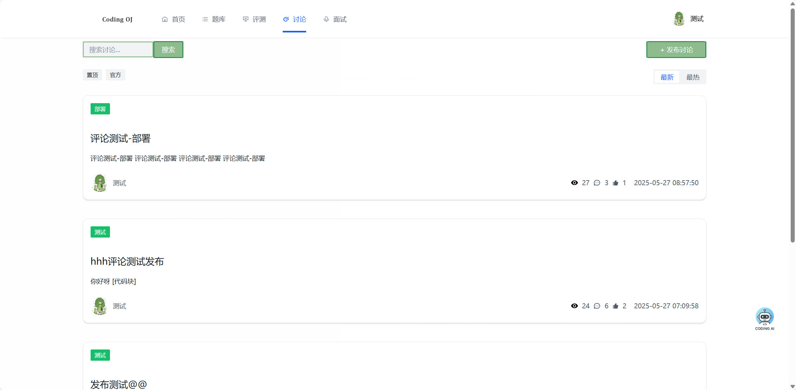
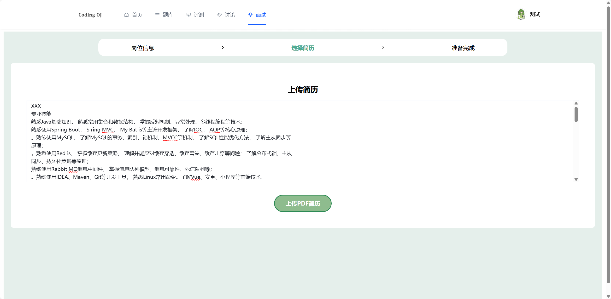
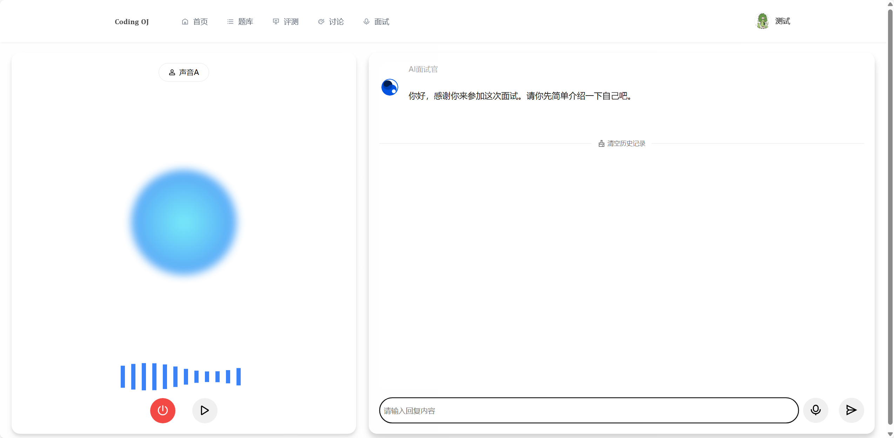

# LONG OJ 在线刷题平台

项目体验地址 => [𝐂𝐨𝐝𝐢𝐧𝐠 𝐎𝐉](http://oj.longcoding.top/#/)

功能列表：

- [x] 代码沙箱，支持Java原生和Docker容器运行代码，用例使用文件形式，暂时为ACM答题形式
- [x] 用户中心，用户信息CRUD，每月刷题总结
- [x] 讨论功能CRUD
- [x] 加入大模型AI编程助手 [deepseek] 流式问答和深度思考

代办事项：

- [x] 目前使用线程池进行异步判题，优化为使用MQ队列进行判题，本地消息表实现可靠性+定时任务补偿
- [x] 消费失败 => 死信队列 => 修正消息表状态
- [x] 题目根据标签搜索
- [x] 优化前端界面
- [x] AI八股面试官⭐⭐⭐
  - [x] 语音问答
  - [x] 基于简历提问
  - [ ] 重写大模型对话存储 - 保存对话数据到MySQL和Redis
  - [ ] 面试结束综合评价 - 基于大模型整理面试者的回答

### 部分页面展示

**首页**

**题库**

**评测**

**题目详情**

**讨论**

**面试**

